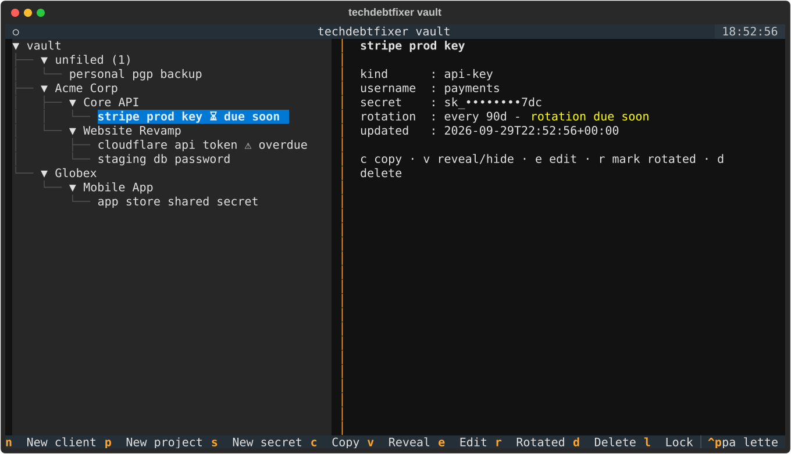

# techdebtfixer

A zero-dependency Python CLI that logs in to a client's environment with
credentials they provide, reviews its security posture and technical debt,
places the organization on the Common Maturity Model (CMM), and produces a
phased remediation roadmap to clear the debt and climb to the next maturity
level.

It also ships an interactive TUI (`techdebtfixer --tui`) that stores client
credentials, project secrets and API keys in an encrypted vault (AES-256-GCM,
protected by a master password).

## Quickstart

```bash
# pip install -e .        # optional; or just run from the repo
python3 -m techdebtfixer --connector demo          # offline synthetic org
python3 -m techdebtfixer --connector local --target .
python3 -m techdebtfixer --connector github --target my-org --token ghp_...
python3 -m techdebtfixer --connector web --target example.com
```

The `demo` connector needs no credentials and produces a full report you can
use to preview output format.

## Credential vault TUI



```bash
pip install 'techdebtfixer[tui]'    # adds textual + cryptography
python3 -m techdebtfixer --tui      # or: techdebtfixer --tui
```

First run creates a vault at `~/.techdebtfixer/vault.vault.json` (override
with `--vault-file PATH`). You pick a master password; the file is encrypted
with AES-256-GCM and the key is derived from the password with
PBKDF2-HMAC-SHA256 (600k iterations). The plaintext database exists only in
memory while the app runs.

The left pane lists clients, their projects, and their secrets; the right
pane shows details for the current selection. An `unfiled` area holds
secrets not attached to any client.

| Key | Action |
|-----|--------|
| `n` | new client |
| `p` | new project (select a client first) |
| `s` | new secret (select client, project, unfiled, or root) |
| `c` | copy selected secret to clipboard |
| `v` | reveal/hide selected secret |
| `e` | edit selected secret |
| `r` | mark selected secret as rotated today |
| `d` | delete selection (with confirmation) |
| `l` | lock the vault (re-prompts for the master password) |
| `?` | help |
| `q` | quit |

Each secret can carry a rotation policy ("rotate every N days" in the
create/edit form). The tree flags secrets with `⚠ overdue` or `⏳ due soon`
(within 14 days of the due date), and the vault home screen counts them.
Pressing `r` stamps a secret as rotated today; saving a new value rotates
it automatically.

Secrets render masked (`ghp••••••••xyz`); reveal and clipboard copy are
explicit actions.

## Connectors

| Connector | Target                | Credentials            | What it checks |
|-----------|-----------------------|------------------------|----------------|
| `demo`    | (none)                | none                   | Deterministic synthetic org: MFA, patching, backups, offboarding, tests, deps, docs, monitoring |
| `github`  | org name              | PAT (`--token`)        | Branch protection, backlog size, licenses, stale repos |
| `local`   | filesystem path       | none                   | Committed secrets, tests, CI config, lockfiles, README/LICENSE |
| `web`     | hostname / URL        | optional bearer token  | TLS validity + expiry, HSTS/CSP and other security headers |

New connectors: subclass `techdebtfixer.connectors.base.Connector`, implement
`validate()` and `gather()`, decorate with `@register`.

## Credentials

Flags (`--token/--username/--password/--domain/--ask-password`), a JSON file
(`--creds-file creds.json` with `{"token": ...}`), or env vars
(`--use-env` with `TDF_TOKEN`, `TDF_USERNAME`, `TDF_PASSWORD`, `TDF_DOMAIN`).
Precedence: file > env > flags. The tool masks secrets in all output; prefer
files or env vars over `--password`.

## Scoring & maturity

Each finding carries a severity (`critical`/`high`/`medium`/`low`/`info`) and
a weight. Passing checks earn their weight, warnings earn half, and the
scorer skips unknown checks. The normalized score maps onto CMM levels:

| Level | Name                    | Threshold |
|-------|-------------------------|-----------|
| 1     | Initial                 | 0.00      |
| 2     | Managed                 | 0.35      |
| 3     | Defined                 | 0.55      |
| 4     | Quantitatively Managed  | 0.75      |
| 5     | Optimizing              | 0.90      |

The scorer converts failing findings to debt points (critical 40, high 20,
medium 10, low 5). The report shows total debt, the gap to the next level,
and a roadmap grouped into phases (critical → high → medium → low). Steps
that clear enough debt to unlock the next CMM level get flagged.

## Output & exit codes

`--format text|json`, `--output FILE` to save. Exit codes: `0` clean,
`1` critical/high failures found (CI-gateable), `2` bad credentials/args,
`3` connector failure.

## Development

```bash
python3 -m unittest discover -s tests -v
```

The assessment CLI itself needs no third-party packages (Python ≥ 3.10,
stdlib only). The vault TUI additionally needs `textual` and `cryptography`
(`pip install 'techdebtfixer[tui]'`).
